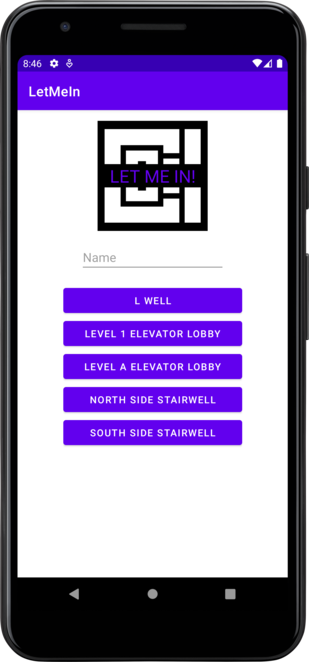

# LetMeIn App

This is an android application built with the [LetMeIn](https://github.com/ComputerScienceHouse/letmein2) API. It utilizes Kotlin and web sockets to connect to LetMeIn servers and dispatch client requests that can then be answered by CSH members.

## Screenshot

## Building

Simply clone this repository into [Android Studio](https://developer.android.com/studio) and use the run configurations to run the app on a VM or physical device.

### Version Compatibility

This project is compatible with Android 5.0 and above, allowing for 98% device coverage.